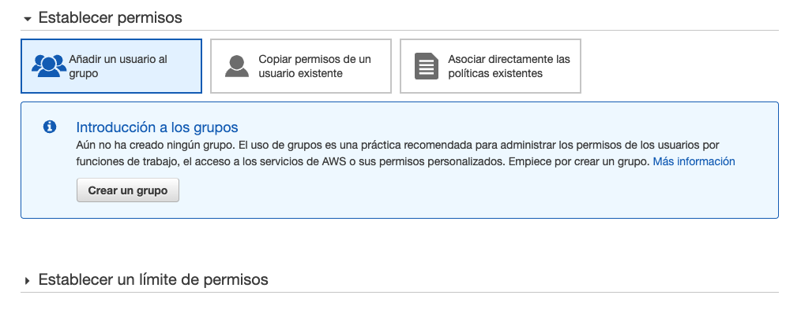

# Tarea 2: Creación de una cuenta de AWS

Nombre: César Augusto Carchi Ludeña

## 1. Creación de la cuenta de AWS

* Accedemos a la página de [AWS](https://aws.amazon.com/es/) y pulsamos sobre **Cree una cuenta de AWS**.

    

* Completamos el formulario de registro. Asegúrate de elegir el tipo de **cuenta personal y el gratuito**.

    

    

    

* Iniciar sesión y acceder a los detalles de la cuenta AWS:

    

    

* Restringir uso de cuenta ROOT unicamente a operaciones críticas. Para ello accedemos a la opción "Cuenta" y nos ubicamos en la opción "Acceso de los usuarios y roles IAM a la información de facturación. Seguido hacemos clic en Editar y marcamos la casilla "Active el acceso de IAM" y pulsamos "Actualizar"

    

    

## Seguridad de lacuenta de AWS

* **Acceder a IAM**: Para ello en la barra de búsqueda escribimos IAM y pulsamos sobre el servicio sugerido.

    

* **Lo primero que vemos al acceder al panel de IAM es una alerta de seguridad que nos indica que no tenemos activado el múltiple factor de autenticación (MFA). Pulsamos sobre “Agregar MFA”** .

    

* **Activamos MFA**:

    

* **Como podemos observar, AWS soporta diferentes tipos de autenticación de múltiple factor, en nuestro caso seleccionamos “Dispositivo MFA virtual” y pulsamos en “continuar”**

    

    

    

## Creación usuario de AWS

Se va a crear un nuevo usuario para realizar acciones específicas en AWS. Con este usuario accederemos normalmente y root solo utilizaremos para acciones de seguridad de la cuenta y facturación.

* **Agregar nuevo usuario**: Dentro del panel de IAM seleccionamos "Usuarios" y "Agregar usuarios"

    

* **Configuración nuevo usuario**: Introducimos un nombre para el usuario, por ejemplo “TESTUSER” y activamos la opción "Contraseña: acceso a la consola de administración de AWS” y “Contraseña personalizada”

    Introducimos una contraseña robusta y desactivamos la opción “Requerir el restablecimiento de contraseña” . Pulsamos en “Siguiente: Permisos”.

    

* **Seguido, creamos un nuevo grupo**:

    

    Ingresamos el nombre del grupo "Console-Admin" y seleccionamos el permiso "AdministratorAccess", finalmente, clic en "Crear grupo" y continuamos con la configuración del usuario "Etiquetas".

    

    

* Seleccionamos "console-Admin" y clic en "Siguiente: Etiquetas"

    

    Pulsamos “Siguiente: Revisar” sin añadir ninguna etiqueta. Finalmente, revisamos que todos los datos son correctos y pulsamos sobre “Crear un usuario”.

    

* **Validar información**:

    

## Configurar Alias para la cuenta de AWS

* En el panel de IAM, pulsamos sobre “Crear” en la esquina superior derecha.

    

* Ingresamos el nuevo alias y una vez creado cerramos la sesión.

    

* Ahora ingresamos con la cuenta "Alias". Para ello seleccionamos "Usuario de IAM" e introducimos el alias de la cuenta y pulsamos sobre "Iniciar sesión".

    

* Adicionalmente, se puede agregar a este usuario MFA.

    