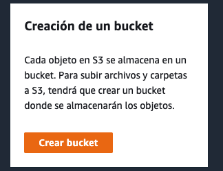

# Alojamiento de Web Estática en AWS S3

César Augusto Carchi Ludeña

## Creación de un bucket en Amazon S3

* ***Acceder al servicio S3:*** Para ello se busca "S3" y se selecciona el primer resultado.

* ***Crear Bucket:*** En el panel de S3, pulsa sobre “Crear bucket”. Ten en cuenta que en Amazon S3 el nombre del bucket debe ser único a nivel global. Esto quiere decir que una vez creado el bucket, su nombre no podrá ser utilizado por ninguna otra cuenta de AWS en ninguna región.

* ***Ingresar nombre del bucket único:*** Ingresar como nombre del bucket "staticweb-1994".

* ***Seleccionar región AWS:*** Seleccionar la región "UE (Irlanda) eu-west-1"

* ***Seleccionar propiedad de objetos:*** selecciona la opción “ACL habilitadas”

* ***Cambiar la configuración del bucket a pública:*** Se debe desactivar la opción “Bloquear todo el acceso público”.
    * ***Aceptar condiciones de cambiar a público:*** Selecciona la opción “Reconozco que la configuración actual pude provocar que este bucket y los objetos que contiene se vuelvan públicos”

* ***Crear Bucket:*** Se pulsa sobre “Crear bucket”.

* ***Así se visualiza al final de la creación del bucket:***

----

## Configuración del bucket para alojar una web estática

* ***Accedemos al bucket creado:*** Para ello seda clic en el nombre del bucket.

* ***Acceder a las propiedades***

* ***Editar alojamientos de sitios web estáticos:*** Dentro del panel de “Propiedades” bajamos hasta encontrar la sección “Alojamiento de sitios web estáticos” y pulsamos el botón “Editar”

    * ***Seleccionar la opción "Habilitar"***
    * ***Seleccionar el tipo de alojamiento:*** Se debe seleccionar la opción “Alojar un sitio web estático”
    * ***Ingresar “Documento Índice”:*** En este campo de texto debemos introducir la página predeterminada de inicio del sitio web, en este caso “index.html”. 
    * ***Guardamos los cambios:*** Finalmente, se debe hacer clic en el botón "Guardar Cambios"

* ***Copiar URL del nuevo sitio web generado:"*** En la pestaña "Propiedades”, en la sección “Alojamiento de sitios web estáticos” copia la nueva url que se ha generado para tu sitio web e introducela en el navegador.

* ***Error 403:*** Este error se muestra ya que los recursos de tu web estática todavía no están en S3

----

## Publicación de la página web estática en S3

* ***Acceder a la pestaña "Objetos":*** Para cargar la página estática, se hace clic en la pestaña "Objetos" y se hace clic en el botón "Cargar"

* ***Agregar archivos:*** Pulsamos sobre “Agregar archivos” y seleccionamos todos los ficheros de la aplicación web estática.

* ***Cargar los archivos agregados previamente:*** Se pulsa sobre “Cargar” y una vez que el proceso termine se hace clic en cerrar.

----

## Configuración del acceso a los objetos

* ***Cambiar la configuración de los objetos a "Publicos"*** Desde la consola de administración de S3, pulsa en el bucket “staticweb-1234” y en la pestaña “Objetos”

* ***Seleccionar todos los objetos cargados***

* ***Acceder a las acciones y hacer publicos los objetos:*** Se pulsa sobre “Acciones” y seleccionamos "Hacer públicos a través de ACL".

* ***Página web estática en AWS S3***

----

## Limpieza del laboratorio

* Para limpiar este laboratorio, en el panel de administración de S3 se pulsa sobre el bucket que se ha creado y sobre el botón “Eliminar”

