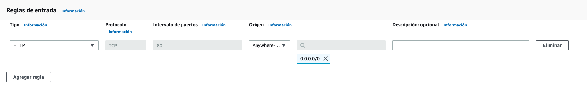

# Despliegue de una aplicación web completa en la nube

César Augusto Carchi Ludeña

## Arquitectura del ejercicio a desplegar:


---

## Configuración del acceso y seguridad

***Security Group de AWS:*** este grupo de seguridad nos permite controlar el tráfico de red entrante y saliente de una instancia de AWS. Para esto lo primero que se hace es crear un grupo de seguridad y configurarlo para que permita conexiones HTTP desde Internet a la instancia.

* Desde la consola accedemos al servicio "**EC2**" de AWS.

    

* Dentro del panel de administración de EC2, en el menú de la izquierda, pulsamos sobre “Security Groups”

    

* Creamos un nuevo grupo de seguridad haciendo clic en el botón "Crear grupo de Seguridad"

    

* Completamos la sección "***Detalles básicos***" con la siguiente información:

    * Nombre del grupo de seguridad: “WebApp-SG”
    * Descripción: “Permitir acceso HTTP”
    * VPC: **Dejamos el valor por defecto.**

    

* En la sección “Reglas de entrada” pulsamos sobre “Agregar regla” y se mostrará un formulario en la misma sección en donde se debe configurar la regla de la siguiente forma:

    

    * Tipo: **“HTTP”**
    * Origen: **“Anywhere-IPv4”**

    

* Finalmente se hace clic en el botón ***"Crear grupo de seguridad"*** que se encuentra en la parte inferior de la página.

    

* Una vez creada la regla se debería visualizar la siguiente pantalla con la información de la regla creada:

    

***Ahora se debe crear el grupo de seguridad que permitirá el acceso desde nuestra aplicación a la base de datos. Para ello se hace clic en "Crear Grupo de seguridad" nuevamente y se configura de la siguiente forma:***

* En la sección "Detalles básicos" se ingresa la siguiente información:

    * Nombre del grupo de seguridad: **“DB-SG”**
    * Descripción: **“Permitir acceso DB”**
    * VPC: **Dejamos el valor por defecto.**

    

* En la sección "Reglas de entrada" agregamos una nueva regla y configuramos de la siguinete forma:

    * Tipo: **“MYSQL/Aurora”**
    * Origen: **“Personalizada” y seleccionamos el Grupo de seguridad “WebApp-SG”**

    

* Finalmente se hace clic en el botón ***"Crear grupo de seguridad"*** que se encuentra en la parte inferior de la página.

    

* Una vez creada la regla se debería visualizar la siguiente pantalla con la información de la regla creada:

    

***Nota:*** Con esto se han establecido las reglas de acceso a la base de datos y a la aplicación web relacionandolas con los grupos de seguridad que se han creado.  Esta es una de las características que nos proporciona Amazon para evitar que tengamos que lidiar a bajo nivel con la infraestructura de red

---

## Creación de la base de datos

***RDS de AWS:*** es un servicio web que facilita la configuración, la operación y la escala de una base de datos relacional en la nube de AWS.

* Desde la consola accedemos al servicio "**RDS**" de AWS.

    

* Dentro del panel de administración de RDS, pulsamos sobre “Crear base de datos”

    

* Dentro de la pantalla de "Crear base de datos" seleccionamos el método de creación de base de datos que queremos utilizar, en este caso será "**Estandar**":

    

* En la sección "Opciones del motor" seleccionamos la opción "**MySQL**" y en versión seleccionamos la opción "**MySQL 5.7.34**":

    

* En la sección "Plantillas" seleccionamos la opción "**Desarrollo y pruebas**":

    


* En la sección "Configuración" ingresamos los siguientes valores:

    * Identificador de instancias de base de datos: **“phonebook-db”**
    * Nombre de usuario maestro: **“dbadmin”**
    * Contraseña maestra: **<se debe ingresar una contraseña a elección>**
    * Confirmar contraseña: **<repetir contraseña>**

    

* En la sección "Configuración de la instancia" seleccionamos la siguiente configuración:

    * **Clases con ráfaga**
    * Seleccionamos la opción "**db.t2.micro**"
    * Marcamos como activada la opción "**Incluir clases de generación anterior**"

    

* En la sección "Disponibilidad y durabilidad" se deja la opción por defecto "**Instancia de base de datos única**" ya que no se va a utilizar esta funcionalidad por ser un entorno de pruebas.

    


* En la sección "Conectividad" nos ubicamos en la opción "Grupos de seguridad de VPC existentes" y seleccionamos el grupo de seguridad "**DB-SG**" (por defecto está el valor "**default**"):

    

* En la sección “Configuración adicional”, en el apartado **“Nombre de base de datos inicial”** introducimos **“phonebook”**. Este nombre se corresponde con un nombre lógico que utilizará la aplicación para referenciar la base de datos.

    

    * En la misma sección, deshabilitamos la opción "**Habilitar la monitorización mejorada**"

    

* Finalmente se hace clic en el botón "**Crear base de datos**" que se encuentra en la parte inferior de la página.

    

* Una vez creada la base de datos se debería visualizar la siguiente pantalla con la información de la base de datos creada:

    
---

## Despliegue de un servidor de aplicación

En este punto se ba a crear un servidor Linux en la cuenta de Amazon e instalar un servidor de aplicación que aloje una aplicación web la cual se conectará a ña base de datos que se creó en el punto anterior.

* Primero accedemos al servicio **EC2** de AWS y pulsamos sobre "**Panel de EC2**".

    

* Seleccionamos la opción "**Lanzar instancia**"

    

* Seleccionamos la opción "**Amazon Linux 2 AMI", que es una imagen de Amazon Linux 2 que se encuentra disponible en la nube de Amazon.

    

* Seguido seleccionamos la opción "**t2.micro**" que es una instancia de tamaño pequeña.

    

* En la sección "Detalles avanzados" nos ubicamos en el campo "**Datos de usuarios**" e ingresamos el siguiente script:

    ```JavaScript
    #!/bin/bash
    yum -y install httpd php mysql php-mysql

    case $(ps -p 1 -o comm | tail -1) in 
    systemd) systemctl enable --now httpd ;; 
    init) chkconfig httpd on; service httpd start ;; 
    *) echo "Error starting httpd (OS not using init or systemd)." 2>&1 esac
        
    if [ ! -f /var/www/html/bootcamp-app.tar.gz ]; then 
    cd /var/www/html wget https://s3.amazonaws.com/immersionday-labs/bootcamp-app.tar tar xvf bootcamp-app.tar
    chown apache:root /var/www/html/rds.conf.php
    fi
    yum -y update
    ```


    

* Ahora crearemos un etiquetas, para ello nos ubicamos en la sección "Nombres y etiquetas" y hacemos clic en "**Agregar etiquetas**" e ingresamos la siguiente etiqueta:

    * Clave: “Name”
    * Valor: “Webserver”

    

* En la sección "Configuraciones de red" seleccionamos "**Selecionar un grupo de seguridad existente**" y marcamos la opción "**WebApp-SG**"

    

* Finalmente se valida la información ingresada y se hace clic en "**Lanzar Instancia**"

    

* Al hacer clic en "Lanzar instancia" nos aparecerá una ventana indicando que seleccionemos un par de claves para conectarnos por SSH. Seleccionaremos la opción "**Continuar sin un par de claves**" ya que no nos conectaremos por SSH y hacemos clic en "**Continuar sin un par de claves**".

    

* Finalmente nos aparecerá la siguiente pantalla con la información de la instancia creada:

    

    * Si accedemos al panel de EC2 y hacemos clic en la opción "Instancias" podemos revisar las instancias creadas.

        

        
        

* Ahora se debe ir a los detalles de la instancia y hacer clic en "**DNS de IPv4 pública**" y este redirigirá a una nueva página con aplicación web.

    

---

### Respuesta esperada:


* En esta pantalla se accede a la pestaña "RDS" y se ingresan los datos de la base de datos que se creo en el paso anterior:


* Una vez ingresados los datos, se debería visualizar la siguiente pantalla en donde se podrá realizar operaciones CRUD sobre la base de datos:

